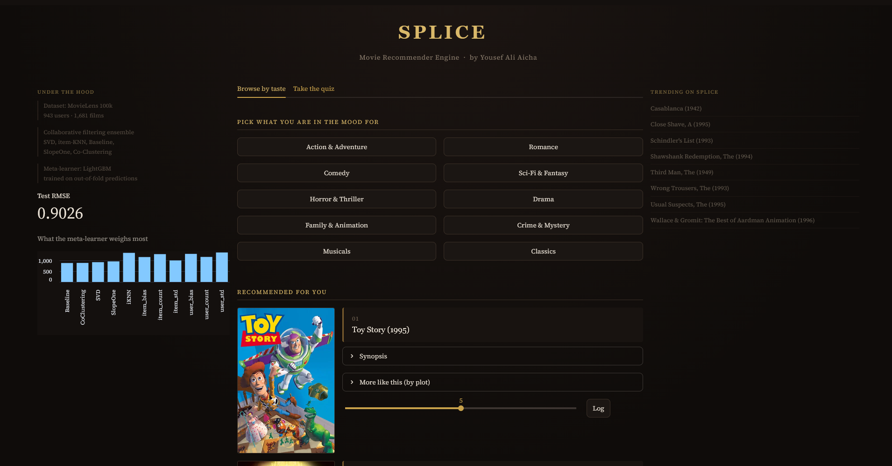
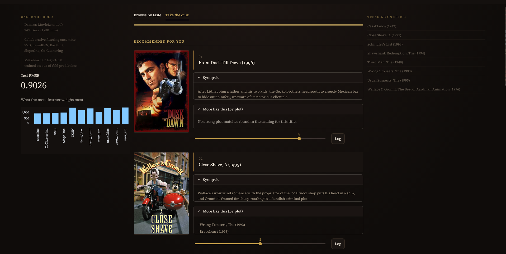
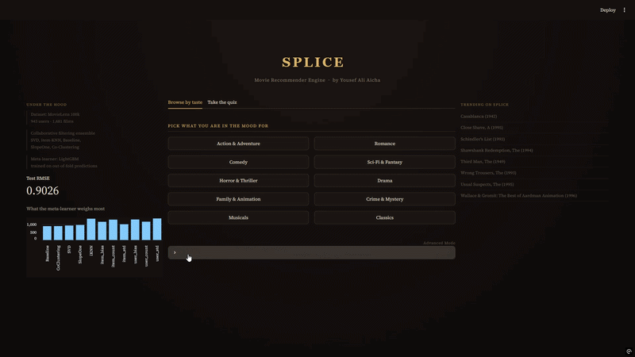
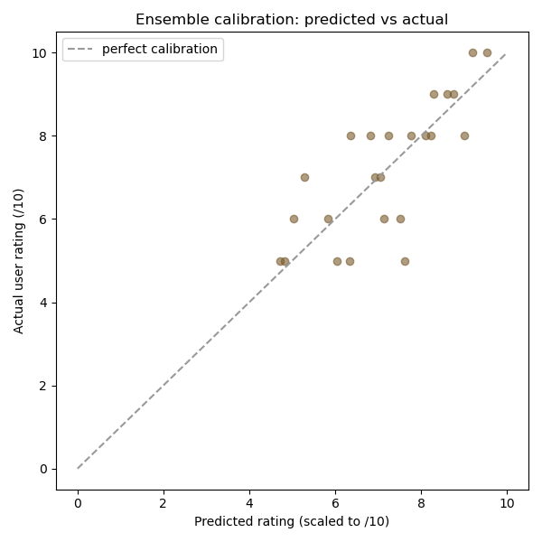
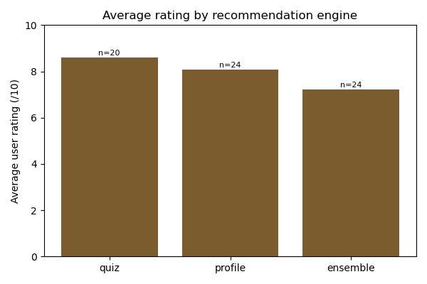

# Splice — Adaptive Movie Recommender Engine


A movie recommender that changes strategy depending on how much it knows about a user — genre-weighted scoring for a first-time visitor, item-based KNN once a few ratings exist, and a five-model stacked ensemble blended by a LightGBM meta-learner once there's enough history to trust it. Wrapped in a Streamlit dashboard that collects feedback and checks its own predictions against what people actually rated.

---

## Contents

- [Features](#features)
- [Benchmarks](#benchmarks)
- [How it works](#how-it-works)
- [Hybridization](#hybridization)
- [Feedback and analysis](#feedback-and-analysis)
- [Project structure](#project-structure)
- [Setup](#setup)
- [Usage](#usage)
- [Engineering decisions](#engineering-decisions)
- [Data and acknowledgements](#data-and-acknowledgements)

---

## Features

**Three recommendation engines, picked automatically**

- **0 ratings** — genre-affinity scoring across the catalog, weighted by how well the movie is rated overall
- **1–4 ratings** — item-based KNN, cosine similarity seeded from the user's highest-rated movie
- **5+ ratings** — SVD, item-KNN-with-means, Baseline, SlopeOne, and Co-Clustering each produce out-of-fold predictions, which a LightGBM meta-learner combines into a final score
- **Hybrid mode (optional)** — the ensemble score blended with a content-embedding similarity signal, available in the Advanced panel

**Dashboard**



- Ten curated taste profiles and a five-question quiz — no account, no user ID, just a mood
- TMDB posters and synopses on every recommendation
- "More like this (by plot)" — a content-based lookup using synopsis embeddings, separate from the collaborative KNN engine
- A 0–10 rating slider on every card, logged with a timestamp, which engine served it, and what it predicted
- Live model diagnostics in the left panel: test RMSE and meta-learner feature importances, read from the last training run
- An Advanced panel for pointing the full ensemble at a specific user ID, with a toggle to compare the pure ensemble against the hybrid blend

**Cold start, stated rather than hidden**



Every quiz and taste-profile result carries a caption naming which engine produced it and why. A first-time visitor has no rating history, so the system says so instead of presenting genre-matched picks as if they came from the trained ensemble. Details in [How it works](#how-it-works).

---

## Benchmarks

| Dataset | Users | Movies | Ratings | Test RMSE |
|---|---|---|---|---|
| MovieLens 100k | 943 | 1,682 | 100,000 | 0.9026 |
| MovieLens 1M | 6,040 | 3,706 | 1,000,209 | 0.8480 |

RMSE is the average size of the gap between a predicted rating and the actual one, on a 1–5 scale — 0.90 means predictions are typically off by under a star. The 1M model's lower RMSE tracks with more ratings per user and per movie giving the collaborative signal more to work with. The two datasets use different train/test split methodology (100k ships with GroupLens's own split, 1M uses a random one here), so this is a consistent result worth reporting, not a controlled scaling experiment.

Base model out-of-fold RMSE, MovieLens 100k:

| Model | RMSE |
|---|---|
| item-based KNN | 0.9294 |
| SVD | 0.9336 |
| Baseline | 0.9464 |
| SlopeOne | 0.9493 |
| Co-Clustering | 0.9708 |
| **Meta-learner (blended)** | **0.8687** |

The meta-learner beats every individual model by a real margin. No single algorithm here is impressive on its own — stacking their out-of-fold predictions with per-user and per-item bias features gets further than any one of them alone.

---

## How it works

### Cold start

A collaborative-filtering model needs history to filter on. A user with zero ratings gives SVD, item-KNN, and the meta-learner nothing to work with, so routing a brand-new visitor through them wouldn't produce a weaker recommendation — it would produce a meaningless one, since none of those models have signal for a user they've never seen.

Splice checks rating count before picking an engine:

| Ratings on file | Engine | Reasoning |
|---|---|---|
| 0 | Genre-affinity scoring | No collaborative signal exists yet. |
| 1–4 | Item-based KNN | Enough for "similar to the one you just rated" to mean something, not enough for the ensemble's bias features to be reliable. |
| 5+ | Stacked ensemble | Enough history for per-user statistics and the meta-learner's blending to carry real weight. |

The quiz and the taste-profile browser are cold start by definition — nobody visiting either has an account — so both run on the genre-affinity path (`src/engines.py::score_by_genre_match`). This is the same fallback the router uses for any real zero-rating user, not a simplified stand-in for the demo. The dashboard states this in the caption under every quiz and profile result. The Advanced panel exists to show the full ensemble against a user who has enough history to trigger it, since a first-time visitor can't do that on their own.

### The ensemble

Five models — SVD, item-KNN-with-means, Baseline, SlopeOne, Co-Clustering — are trained with 10-fold out-of-fold cross-validation: every row in the training set gets predicted by a model that never saw that row during fitting. Those five predictions, plus per-user and per-item bias/spread/count features, are what the LightGBM meta-learner trains on. This keeps the meta-learner from learning to trust whichever base model overfit hardest — it only sees held-out predictions.

**SVD++ was tried and dropped.** It usually outperforms plain SVD on MovieLens-style data, so it went in as a sixth base model at first. Out-of-fold, it came back at 1.0755 RMSE — worse than the untouched Baseline model (0.9464), and by a wide margin the slowest to train. It was cut rather than kept as dead weight.

**A tuning pass gave a mixed result, reported as one.** A random search (`src/tune.py`) ran each base model and the meta-learner through a comparison on a single validation split, since a full 10-fold search across every candidate would have taken hours for a secondary gain. SVD's tuned config was a real win — 0.9725 → 0.9336 OOF RMSE on 100k, 0.9254 → 0.8710 on 1M — and was kept. The meta-learner's tuned config looked better on that one validation split but regressed under the real 10-fold procedure (0.8684 → 0.8937), a single-split overfit, and was reverted. Tuning helped in one place and didn't in another; both outcomes are reflected in the final numbers.

---

## Hybridization

Every movie's TMDB synopsis is embedded with `sentence-transformers` (`all-MiniLM-L6-v2`) and indexed with FAISS for cosine similarity search. Two features come out of this:

- **"More like this (by plot)"** — a direct nearest-neighbor lookup against the embedding index. This is different from the collaborative KNN engine above: KNN finds movies that were *rated* similarly by the same people; this finds movies that are *about* similar things, independent of who watched them.
- **Hybrid blend** — a per-user taste vector, built by averaging the embeddings of their highly-rated movies, blended with the ensemble's collaborative score at 85% ensemble / 15% content. Available as a toggle in the Advanced panel.



This is a blend computed at inference time, not a feature threaded into the meta-learner's leakage-safe training loop. Doing that properly would mean recomputing content similarity per fold with the same rigor as the bias features already get — a rebuild of the training pipeline that wasn't justified for what is, here, a secondary signal layered on top of a model that already works.

**A finding worth naming.** Early testing of "more like this" turned up weak, coincidental matches once genuinely similar movies ran out of a query's neighborhood — traced by printing the actual synopsis text and cosine scores side by side (`analysis/inspect_embeddings.py`), not guessed at from titles. The cause was catalog depth: on 100k, once two or three real matches for a query are exhausted, FAISS still returns something as the next-nearest neighbor, just not a meaningfully similar one. A similarity floor (0.47, set from a measured score gap) now withholds a result rather than presenting a coincidence as a recommendation — visible above in the quiz screenshot, where a query with no strong matches says so. Re-testing the same logic on the 1M catalog showed a much cleaner separation between real and coincidental matches, the expected outcome if catalog size was the actual constraint. The full investigation is filed as a closed issue on this repo.

---

## Feedback and analysis

Every rating given through the dashboard is logged with a timestamp, the engine that produced it, the model's predicted score where one exists, and what the person actually rated. `analysis/feedback_analysis.py` turns that log into four plots; the two below come from `analysis/generate_demo_data.py`, which produces synthetic feedback correlated with real trained predictions so the analysis pipeline has something to show without waiting on organic use. Labeled as simulated — not a substitute for the real thing, just enough volume to show the pipeline works.

<p align="center">
  
  
</p>

The calibration plot checks whether the ensemble's confidence lines up with what people actually think — points near the dashed diagonal mean a predicted 4-star movie tends to get rated close to 4 stars. The engine comparison asks a more direct question: does the five-model ensemble actually satisfy people more than a simple genre match, or is the extra machinery not paying for itself.

---

## Project structure

```
splice-engine/
├── analysis/
│   ├── feedback_analysis.py    # calibration, engine comparison, rating trends
│   ├── generate_demo_data.py   # synthetic feedback for demos, separate from real logs
│   ├── inspect_embeddings.py   # diagnostic: prints synopsis text + similarity scores
│   └── figures/
├── dashboard/
│   └── app.py
├── data/
│   ├── movie_info.tsv          # MovieLens 100k
│   ├── user_info.tsv
│   ├── ratings.tsv
│   ├── ratings_train.tsv
│   ├── ratings_test.tsv
│   └── ml-1m/                  # MovieLens 1M (.dat files)
├── feedback/
│   └── ratings_log.csv         # grows as the dashboard is used
├── models/
│   ├── ml-100k/                # trained artifacts, per dataset
│   └── ml-1m/
├── notebooks/
│   └── Recommender.ipynb       # guided walkthrough, loads pre-trained models
├── src/
│   ├── data.py                 # MovieLens 100k loader
│   ├── data_1m.py               # MovieLens 1M loader
│   ├── features.py             # statistical features, shared across datasets
│   ├── engines.py              # the three-tier router and the ensemble
│   ├── embeddings.py           # content embeddings and the FAISS index
│   ├── hybrid.py                # collaborative / content blending
│   ├── evaluate.py             # RMSE, precision@K, recall@K, coverage
│   ├── train.py                 # end-to-end training entry point
│   ├── tune.py                  # hyperparameter search
│   ├── tmdb.py                  # TMDB API wrapper, disk-cached
│   └── config.py                # .env / secrets loading
├── tests/
│   └── test_engines.py
├── .env.example
├── .gitignore
├── LICENSE
├── requirements.txt
└── README.md
```

---

## Setup

### 1. Environment

```bash
conda create -n myenv python=3.11
conda activate myenv
conda install pip
python -m pip install -r requirements.txt
```

`scikit-surprise` compiles a C extension on install. On Windows this needs a working C++ build toolchain; installing via `pip` rather than `conda` tends to sidestep the issue, which is how `requirements.txt` is already set up.

### 2. Datasets

MovieLens 100k ships with the repo under `data/`.

MovieLens 1M is optional and downloads separately — extract into `data/ml-1m/` so the three `.dat` files sit at `data/ml-1m/users.dat`, `data/ml-1m/movies.dat`, `data/ml-1m/ratings.dat`. Source: [grouplens.org/datasets/movielens/1m](https://grouplens.org/datasets/movielens/1m/)

### 3. TMDB API key

Needed for posters, synopses, and the content embeddings.

1. Create a free account at [themoviedb.org](https://www.themoviedb.org/)
2. Go to *Settings → API* and request a key — free, developer tier, approved almost immediately
3. Copy the template and fill in the key:
   ```bash
   cp .env.example .env
   ```
   ```
   TMDB_API_KEY=your_key_here
   ```

`.env` is gitignored and never committed.

---

## Usage

### Train a model

```bash
python -m src.train --dataset ml-100k
python -m src.train --dataset ml-1m
```

Runs the full pipeline — loading, popularity/KNN construction, 10-fold out-of-fold base model training, meta-learner training, a full retrain, and held-out evaluation — and saves everything under `models/<dataset>/`. The 100k run takes a few minutes; 1M takes proportionally longer.

### Build the content index

Needed for "more like this" and hybrid mode. Requires the TMDB key from setup step 3.

```bash
python -m src.embeddings --dataset ml-100k
python -m src.embeddings --dataset ml-1m
```

Downloads the embedding model (~90MB) once and fetches a synopsis for every movie in the catalog. Both are cached, so this only needs to run once per dataset.

### Run the dashboard

```bash
streamlit run dashboard/app.py
```

Opens at `localhost:8501`. Requires a trained model for the dataset it points to (`ml-100k` by default).

### Run the hyperparameter search

```bash
python -m src.tune --dataset ml-100k --iterations 15
```

A random search over each base model and the meta-learner, evaluated on a single train/validation split. Prints the best configuration found; applying it means manually updating `src/engines.py` and retraining for a real 10-fold-confirmed number — see [How it works](#the-ensemble) for why that extra step matters.

### Generate feedback and run the analysis

```bash
python -m analysis.generate_demo_data
python -m analysis.feedback_analysis --demo
```

Or, without `--demo`, `feedback_analysis.py` reads whatever real feedback has accumulated in `feedback/ratings_log.csv` from actual dashboard use. Figures are saved to `analysis/figures/`.

### Inspect an embedding match

```bash
python -m analysis.inspect_embeddings --dataset ml-100k --title "GoodFellas"
```

Prints a movie's synopsis alongside its nearest neighbors' synopses and raw cosine similarity scores — the tool used to diagnose the matching-quality issue described in [Hybridization](#hybridization).

### Run the tests

```bash
python -m pytest tests/ -v
```

---

## Engineering decisions

A short, honest log of the calls that shaped this project, kept as it happened rather than cleaned up after the fact.

- **SVD++ was dropped on out-of-fold evidence**, not on an assumption that it wouldn't help. See [The ensemble](#the-ensemble).
- **The test suite found two real bugs.** `tests/test_engines.py` surfaced a missing bound on neighbor count in `get_knn_recs` that could crash on a small catalog, and something more consequential: the ensemble's candidate list was built from `train_master` instead of the full catalog, meaning a movie with zero ratings from anyone could never be recommended regardless of what the ensemble would have predicted for it. Both are fixed. RMSE didn't move either time, which confirms the bugs were silent rather than accuracy-affecting — they were still worth catching.
- **Hybridization is a post-hoc blend, a deliberate scope decision** rather than an oversight. See [Hybridization](#hybridization) for the reasoning and what a fuller integration would require.
- **Content-match quality was investigated with data, not dismissed**, and the fix — a measured similarity floor — is visible directly in the dashboard's empty-state message.
- **Tuning is reported as a mixed result because it was one.** SVD's config improved the model; the meta-learner's tuned config was tested and reverted after it failed to generalize past the split it was chosen on.
- **Two datasets, trained and evaluated independently**, since retraining on more data isn't automatically a controlled experiment unless the surrounding methodology matches too. The 100k/1M split difference is called out in the benchmarks table rather than left unmentioned.

---

## Data and acknowledgements

**MovieLens** — F. Maxwell Harper and Joseph A. Konstan. 2015. *The MovieLens Datasets: History and Context.* ACM Transactions on Interactive Intelligent Systems (TiiS) 5, 4, Article 19 (December 2015), 19 pages. [doi.org/10.1145/2827872](https://doi.org/10.1145/2827872) — GroupLens Research, University of Minnesota. [grouplens.org/datasets/movielens](https://grouplens.org/datasets/movielens/)

**TMDB** — this product uses the TMDB API but is not endorsed or certified by TMDB.

**Libraries** — [scikit-surprise](https://surpriselib.com/) (Nicolas Hug), [LightGBM](https://lightgbm.readthedocs.io/) (Microsoft), [sentence-transformers](https://www.sbert.net/) (UKP Lab), [FAISS](https://github.com/facebookresearch/faiss) (Meta AI Research), [Streamlit](https://streamlit.io/).

---

## License

MIT License — see [LICENSE](LICENSE) for full terms.
